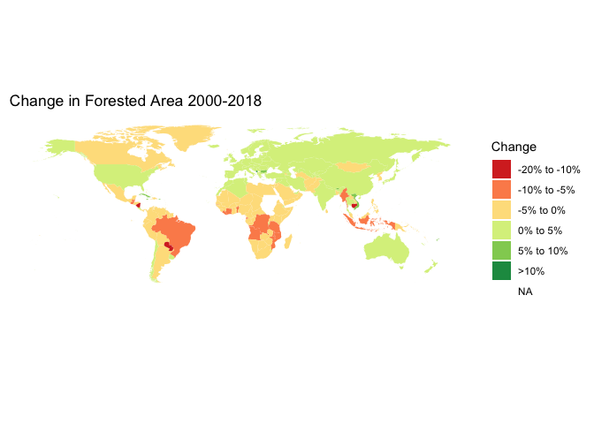

World Bank Indicator Visualizations
================
Kyle Chen
2/21/2021

## CO2 Emissions by Country

<!-- -->

data wrangling:

``` r
top_6_co2_countries <- 
  wb(country = "countries_only", indicator = c("EN.ATM.CO2E.KT"), mrv = 1) %>%
  arrange(-value) %>%
  head(6)
```

visualization:

``` r
top_6_c02_plot <- ggplot(data = top_6_co2_countries) +
  geom_col(mapping = aes(x = reorder(iso3c, value), y = value)) +
  labs(title = "Top 6 Countries by CO2 Emissions", x = "Country (iso3)", 
       y = top_6_co2_countries$indicator) +
  theme(plot.title = element_text(color="black", size=16, face="bold"))
```

##### Insight:

All of the countries that are on this list are developed countries,
except India. According to the news from [the Washington
Post](https://www.washingtonpost.com/climate-solutions/2020/06/12/india-emissions-climate/),
“*Coal will remain a major part of India’s power sector in the coming
decades, and the country is still building coal-fired plants.*” The
government of India will need policies to lower pollution and carbon
emissions in the near future, and from my perspective and the bar chart
below, I believe they will need to find a more eco-friendly way to
produce electricity, instead of relying on coal-fired plants.

## Sources of Electric Power in India

<!-- -->

data wrangling:

``` r
india_electric <- 
  wb(country = 'IND', indicator = c("EG.ELC.FOSL.ZS", "EG.ELC.RNWX.ZS"),
     mrv = 3, return_wide = TRUE) %>%
  mutate(electric_OGC = EG.ELC.FOSL.ZS, electric_renewable = EG.ELC.RNWX.ZS, 
         other = 100-(EG.ELC.FOSL.ZS+EG.ELC.RNWX.ZS)) %>%
  gather(key= category, value = value, other, electric_renewable, electric_OGC)
```

visualization:

``` r
india_electric_plot <- 
  ggplot(india_electric, aes(fill=category, y=value, x=date)) + 
  geom_bar(stat="identity", position="dodge") +
  geom_text(aes(label=round(value, 1)), position=position_dodge(width=0.9), vjust=-0.25) +
  labs(title = "India Electricity Production from 2013 to 2015", x = "Year", y= "Percentage") +
  theme(plot.title = element_text(color="black", size=14, face="bold")) + 
  scale_fill_discrete(name= "Source of Production", labels = c("oil, gas, and coal", "renewable", "other"))
```

<p>

 

</p>

## Forestation over Time

One of the main contributors to global warming is deforestation. Based
on the graph, countries that are closed to the equator are losing their
forest throughout this time period.
<!-- -->

data wrangling:

``` r
forest_area <- 
  wb(country = "countries_only", indicator = c("AG.LND.FRST.ZS"), mrv = 20) %>% 
  spread(key = date, value = value)
forest_area <- 
  mutate(forest_area, forest_change = forest_area$`2018` - forest_area$`2000`) %>%
  select(iso3c, country, forest_change) #create a new column of the calculation between 2018 and 2000

world_map <- map_data("world")
world_map <- world_map %>% mutate(iso3c = iso.alpha(region, n=3)) %>%
  select(iso3c, region, group, long, lat)

res_map_df <- left_join(world_map, forest_area, by = "iso3c") %>%
              subset(select = -c(country))
res_map_df <- mutate(res_map_df, forest_change = round(res_map_df$forest_change)) %>%
              mutate(cut_change = cut(res_map_df$forest_change, breaks = c(-Inf, -20, -10, -5, 0, 5, 10, Inf),
                labels = c("<-20%", "-20% to -10%", "-10% to -5%", "-5% to 0%", "0% to 5%", "5% to 10%",">10%")))
```

visualization:

``` r
world_forest<- ggplot(data= res_map_df) +
  geom_polygon(
    mapping = aes(x = long, y = lat, 
                  fill = cut_change, 
                  group = group))

world_forest_plot <- world_forest +
  coord_quickmap() +
  scale_fill_brewer(palette = "RdYlGn", name="Change") +
  theme_bw() +
  theme(axis.line = element_blank(), 
        axis.text = element_blank(),
        axis.title = element_blank(),
        axis.ticks = element_blank(), 
        plot.background = element_blank(),
        panel.grid.major = element_blank(),
        panel.grid.minor = element_blank(),
        panel.border = element_blank()
        ) +
  labs(title ="Change in Forested Area 2000-2018")
```

<p>

 

</p>

## Population Trend in Japan From 1996 to 2020

<!-- -->

data wrangling:

``` r
population_growth <- wb(country = "JP", 
                        indicator = c("SP.POP.0014.TO.ZS", "SP.POP.65UP.TO.ZS"), mrv = 25) %>% 
    select(date, value, indicatorID) %>% 
    spread(key = indicatorID, value = value) %>% 
    rename("Population ages 0-14"="SP.POP.0014.TO.ZS",
           "Population ages 65-"="SP.POP.65UP.TO.ZS") %>% 
    gather(key= indicator, value = value, -date)
```

visualization:

``` r
population_plot <- ggplot(data = population_growth , mapping = aes(x = date, y = value, 
                                                                   color = indicator, 
                                                                   group = indicator)) +
  geom_point() +
  geom_line() +
  labs(title = "Toddler and Elder population in Japan", x = "Year", y = "Population (%)") +
  theme(legend.position= c(.05, .95), legend.justification = c("left", "top"), 
        axis.text.x = element_text(face="plain", color="#616161",size= 7, angle=0),
        plot.title = element_text(color="black", size=16, face="bold")) +
  scale_x_discrete(guide = guide_axis(n.dodge = 2)) +
  scale_color_discrete(name= "Age", labels = c("0-14", "65 and above"))
```

##### Insight:

Japan starts to become an aging society in 1997, and clearly the gap
between these two age groups is significantly increasing. According to
the news from [Diplomat
Media](https://thediplomat.com/2019/11/how-does-japans-aging-society-affect-its-economy/),
“*Due to the nation’s aging and shrinking population, there is an
increased need to address the labor shortage. People eventually retire
and leave the workforce as they start aging, and at present, there are
not enough young people in Japan to fill this vacuum owing to the
decline in the fertility rate as well.*” One of the causes that might
have effect to this factor is that Japan has a well-developed health
care system and have kept developing, thus, their elder population keeps
booming.

<p>

 

</p>

###### Sources of Data:

  - [World Bank Open Data](https://data.worldbank.org/)
  - [Package
    ‘wbstats’](https://cran.r-project.org/web/packages/wbstats/wbstats.pdf)
